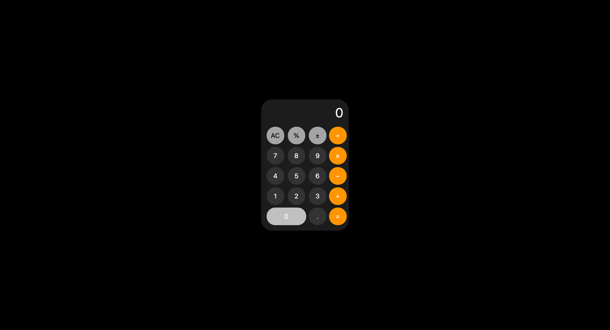

# 📱 iOS Calculator App

A sleek, minimal replica of the iOS calculator built entirely in **vanilla JavaScript**, with no HTML or CSS frameworks. Clean, fast, and lightweight.



🔗 **Live Demo**: [jayson-s.github.io/iOS-calculator-app](https://jayson-s.github.io/iOS-calculator-app/)

---

## ✨ Features

- Fully dynamic layout created with JavaScript
- iOS-inspired color scheme and button layout
- Basic arithmetic operations (+ − × ÷)
- Responsive design with wide `0` key and circular buttons
- Clean UI with no external libraries

---

## 🛠️ Technologies

- JavaScript (DOM manipulation)
- CSS (inline via JS)
- HTML (basic scaffold)

---

## 🚀 Getting Started

### 1. Clone the Repository
```bash
git clone https://github.com/jayson-s/iOS-calculator-app.git
cd iOS-calculator-app
```

### 2. Open Locally
Double-click `index.html` or use Live Server if you’re using VS Code.

---

## 📄 License

MIT — use it freely and make it your own!

---

## Author

Built by [Jayson Sandhu](https://www.jaysonsandhu.com)